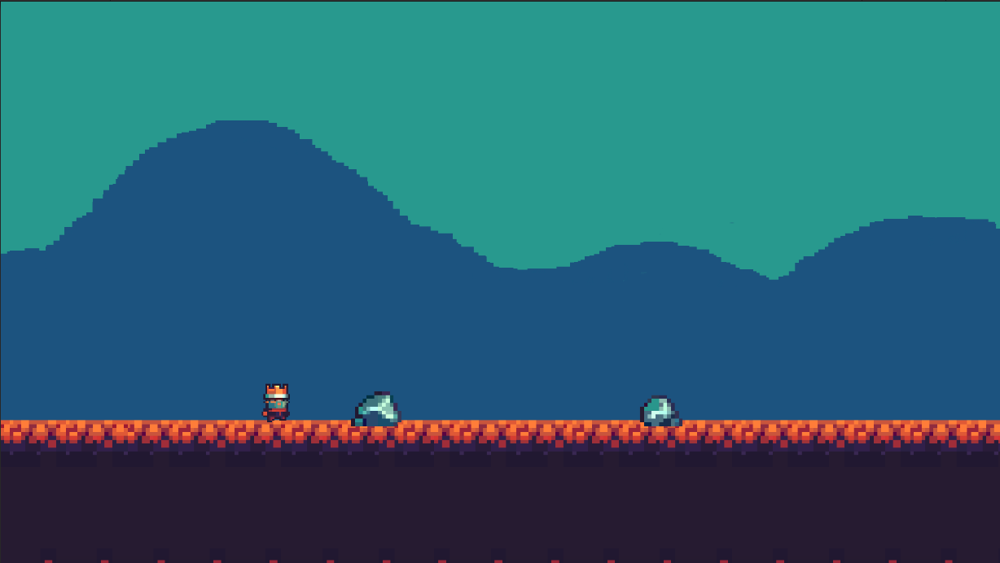

# Juego 2d en Unity (Endless Runner)

Hola, este reprositorio fue creado a partir de el siguiente curso en Youtube:
[Tutorial](https://www.youtube.com/playlist?list=PLvS4Ct-H_3MuwjEm8VZ5W-zvrH8xiNaWy)

# Prueba el juego en Unity
El juego fue desarrollado en `Unity v.2019.3`. Es recomendable tener la misma versión para que todo funcione justo como en los videos.

Para probar el juego puedes clonar el repositorio o descargarlo. 
1. En la parte de arriba a la derecha hay un botón que dice `Clonar o Descargar` Dale click y descarga el zip.
2. Descomprime el archivo.
3. Al descomprimir el archivo se genera un nueva carpeta. Puedes abrir *Unity Hub* y seleccionar esa carpeta para abrir el juego.